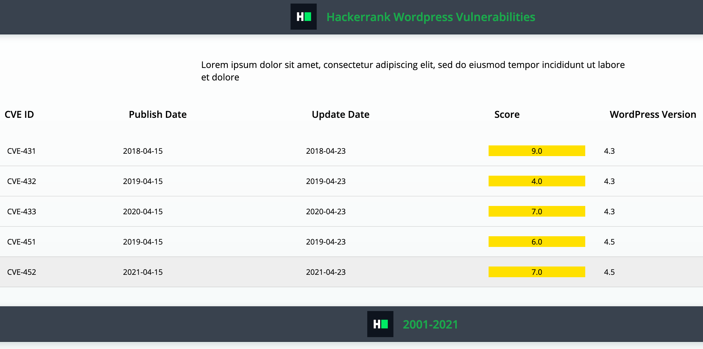

## Environment:
- .NET version: 5
- Selenium Chrome Driver: 85.0.0

## Read-Only Files:
- VulnerabilitiesScraping/*
- VulnerabilitiesScrapingTests/TestSetUp/*

## Requirements:
In this challenge, you are going to use selenium chrome driver which uses headless driver oprions. So you neither need to setup the browsers like Firefox, Chrome nor a web driver executables like FirefoxDriver, ChromeDriver.
You are given a dummy website like nvd.com or cvedetails.com which shows all the WordPress vulnerabilities of all the WordPress versions in a tabular format. Now your task is to scrap all the vulnerabilities of a given WordPress version.

There is a class `VulnerabilitiesImplementation` which has 2 methods:
 
`List<String> scrapVulnerabilitiesOf(WebDriver driver, string vulnPageUrl, string wpVersion)`:
 - browse the `vulnPageUrl` and filter rows having given `wpVersion` and collect `CVE ID` column.
 - its source code structure is like `VulnerabilitiesScraping/Views/Home/Index.cshtml`.
 - it should return a list of CVE IDs of given `wpVersion`.
 
`String topVulnerabilityOf(WebDriver driver, string vulnPageUrl, string wpVersion)`:
 - browse the `vulnPageUrl` and find the row with highest score having `wpVersion` and collect the corresponding `CVE Id`.
 - its source code structure is like `VulnerabilitiesScraping/Views/Home/Index.cshtml`.
 - vulnerability score is unique across same `wpVersion`.
 - it should return the `CVE ID` of a highest scored vulnerability.
  
where the `vulnPageUrl` is the URL of the vulnerabilities page and `wpVersion` is the version of which vulnerabilities to be scraped.

There are tests for testing correctness of each methods. So you can make use of these tests while debugging/checking your implementation.
The test's setup method bootstraps an embedded jetty server and deploys small web app which displays randomly generated website. 
The example website is given in the `website` folder where you can view the structure of search page and result page but data displayed are random and will change on every refresh.

The provided vulnerabilities page will look like: 



Your task is to complete the implementation of those 2 methods so that the unit tests pass while running the tests.

## Commands
- run: 
```bash
dotnet run
```
- install: 
```bash
dotnet install
```
- test: 
```bash
dotnet test
```
